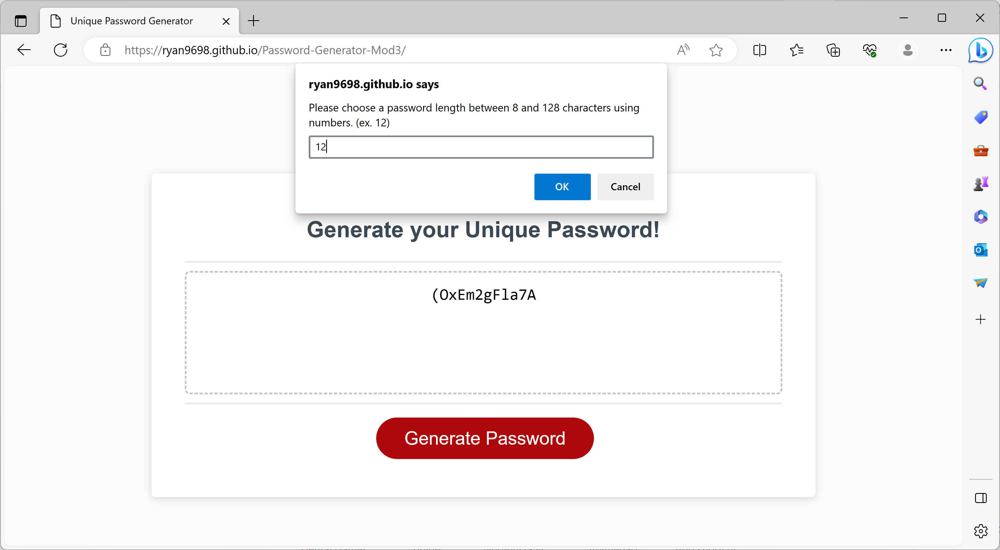
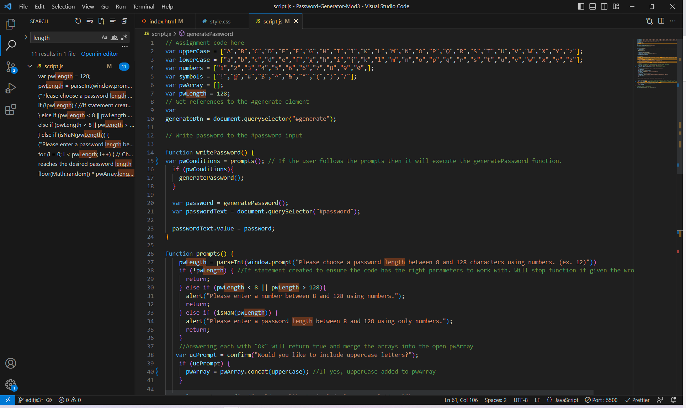

# Module 3 Challenge: Unique Password Generator

## Description

The unique password generator serves the purpose of providing a user with a series of randomly generated characters 
to form a more secure password option for use on different websites. The program is initialized by pressing the 
generate password button on the webpage. When pressed, a series of prompts will display asking the user questions
to help them generate a password. The program allows between 8 and 128 characters, the use of upper and lower case
letters, numbers, and special characters. Once the parameters have been established, the approved characters are put
into an array and randomly generated using a for loop to get to the desired password length. The program then displays
the result in the window provided on the webpage.

This project had a steep learning curve but has been the most interesting project so far for me and has been very rewarding.
I see this kind of feature being applicable to many websites and while working on it, I was thinking of ways to
improve on the idea as my skillset develops. I learned a great deal about loops and methods through designing this project
and enjoyed learning about them as well as picking up some interesting tips along the way. This project helped me understand
what it is like when you write a program and hit a block and ways to overcome them. Through troubleshooting, I was able to get
a much better understanding of how the code actually operates and how the variables interact with each other. I was excited 
to experience my first genuine "programming" assignment and look forward to developing my skillset.

## Installation

N/A

## Usage

To use this program, the user needs to click on the "Generate Password" button located on the main page. when clicked, the user
will be asked a series of questions through prompts to help select a password. Password length must be between 8 and 128 characters
and can include upper and lowercase letters, numbers, and special characters. After selecting the criteria, the window will display a 
series of randomly generated characters that can be used as a password.

## Credits

The files necessary for this project were pulled from The Coding Bootcamp's GitHub respository. The HTML file, CSS file,
as well as some starter Javascript code was supplied at:
https://github.com/coding-boot-camp/friendly-parakeet

## License

Please refer to the LICENSE in the repo.

## Link

https://ryan9698.github.io/Password-Generator-Mod3/

## Screenshots 

